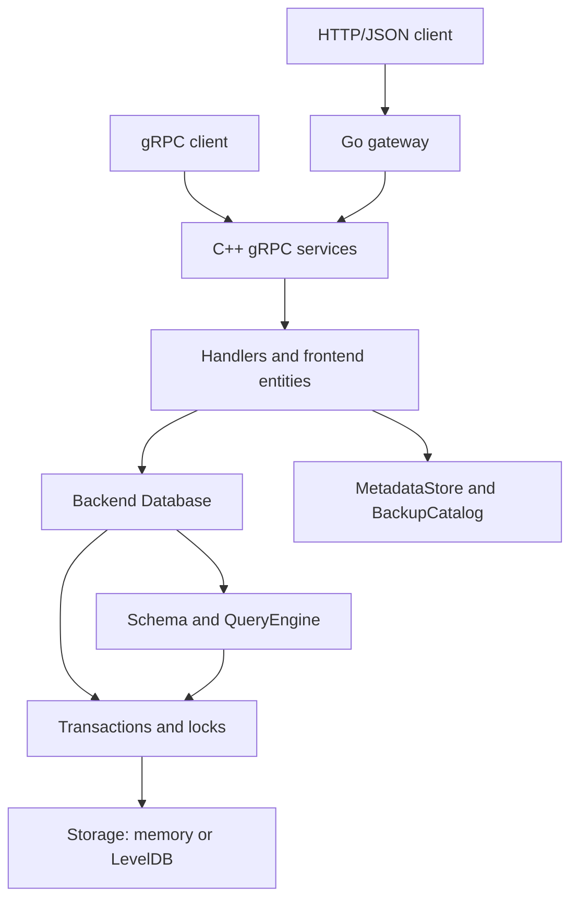

<!-- generated-by: gsd-doc-writer -->
# Architecture

## System overview

Cloud Spanner Emulator (Extended) serves the Spanner gRPC API locally, with an optional Go HTTP/JSON gateway. The gateway starts the C++ gRPC server as a subprocess and proxies REST requests to it. The gRPC frontend owns resources, sessions, and API conversion; each backend `Database` owns its schema, query engine, transactions, locks, and multi-version row storage. Without `--data_dir`, state is in memory. With `--data_dir`, rows use LevelDB and control metadata is saved in JSON files.

## Component diagram

## Data flow

1. [`gateway_main.go`](../binaries/gateway_main.go) can start the C++ server, wait for its instance admin RPC to respond, then serve HTTP/JSON through [`gateway.go`](../gateway/gateway.go). gRPC clients connect directly to the C++ server.
2. [`emulator_main.cc`](../binaries/emulator_main.cc) restores durable state before opening the gRPC listener when `--data_dir` is set. [`server.cc`](../frontend/server/server.cc) registers the Spanner, database admin, instance admin, and operations services. Each RPC is dispatched through the handler registry in [`handler.cc`](../frontend/server/handler.cc).
3. A handler converts protobuf inputs and uses the frontend managers and entities. For example, [`ExecuteSql`](../frontend/handlers/queries.cc) obtains a session and transaction, then calls [`frontend::Transaction`](../frontend/entities/transaction.cc). That wrapper delegates to the backend query engine with a transaction-specific reader and, for writes, a writer.
4. [`QueryEngine`](../backend/query/query_engine.cc) analyzes GoogleSQL or PostgreSQL-dialect SQL against the database catalog and uses GoogleSQL prepared evaluators for queries and DML. [`SchemaUpdater`](../backend/schema/updater/schema_updater.cc) processes DDL separately. Backend transactions apply committed row operations through the [`Storage`](../backend/storage/storage.h) interface.
5. [`Database::Create`](../backend/database/database.cc) selects [`InMemoryStorage`](../backend/storage/in_memory_storage.h) or [`PersistentStorage`](../backend/storage/persistent_storage.h). In persistent mode, [`MetadataStore`](../frontend/persistence/metadata_store.h) saves resources and schema history in `metadata.json`; [`BackupCatalog`](../frontend/persistence/backup_catalog.h) saves backup and operation metadata in `backup_catalog.json`, while backup row snapshots occupy separate LevelDB directories. See [persistent storage internals](internals/persistent-storage.md) for the recovery protocol and file layout.

## Key abstractions

| Abstraction | Responsibility |
|---|---|
| [`ServerEnv`](../frontend/server/environment.h) | Owns the frontend managers, clock, metadata store, and backup catalog. |
| [`DatabaseManager`](../frontend/collections/database_manager.h) | Publishes and looks up active databases and coordinates their persistent directories. |
| [`frontend::Transaction`](../frontend/entities/transaction.h) | Keeps API-level transaction state and wraps backend read-only or read-write transactions. |
| [`backend::Database`](../backend/database/database.h) | Composes the schema, query, lock, transaction, and storage subsystems for one database. |
| [`SchemaUpdater`](../backend/schema/updater/schema_updater.h) | Parses and applies DDL, including schema validation and backfill work. |
| [`QueryEngine`](../backend/query/query_engine.h) | Analyzes and executes SQL against the database schema and transaction context. |
| [`ReadWriteTransaction`](../backend/transaction/read_write_transaction.h) | Buffers mutations, enforces transaction rules, and commits through storage. |
| [`Storage`](../backend/storage/storage.h) | Timestamped row lookup, range reads, writes, and deletes, implemented in memory or with LevelDB. |
| [`MetadataStore`](../frontend/persistence/metadata_store.h) and [`BackupCatalog`](../frontend/persistence/backup_catalog.h) | Persist resource/schema state and backup/operation state when a data directory is configured. |

## Directory structure

| Directory | Purpose |
|---|---|
| `binaries/` | Go gateway and C++ gRPC entry points. |
| `gateway/` | HTTP/JSON proxy and gateway build configuration. |
| `frontend/server/`, `frontend/handlers/` | gRPC services, dispatch, and RPC implementations. |
| `frontend/collections/`, `frontend/entities/`, `frontend/persistence/` | Resource/session state, API-facing objects, and durable control metadata. |
| `backend/schema/`, `backend/query/` | DDL/catalog logic and SQL analysis/execution. |
| `backend/transaction/`, `backend/locking/`, `backend/access/` | Transaction rules, locks, and row access. |
| `backend/storage/`, `backend/database/` | Multi-version storage implementations and their database owner. |
| `common/`, `third_party/spanner_pg/` | Shared configuration/errors and the PostgreSQL-dialect parser integration. |
| `tests/`, `tools/` | Integration tests and feature-coverage validation. |

Implementation-focused tests include [`queries_test.cc`](../frontend/handlers/queries_test.cc), [`query_engine_test.cc`](../backend/query/query_engine_test.cc), [`persistent_storage_test.cc`](../backend/storage/persistent_storage_test.cc), and [`gateway_test.go`](../gateway/gateway_test.go).
